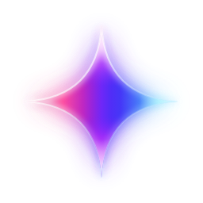
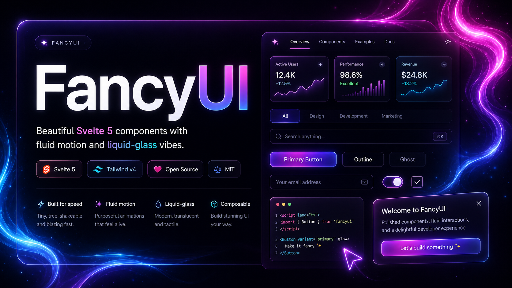

<p align="center">
  
</p>

# fancy-ui

Beautiful animation and UI components for **Svelte 5**.


<p align="center">
  <a href="https://www.anthropic.com/claude-code">
    <picture>
      <source media="(prefers-color-scheme: dark)" srcset=".github/claude-for-open-source-program-dark.svg">
      
    </picture>
  </a>
</p>

<p align="center">
  <a href="https://fancy-ui.rama.app">
    
  </a>
</p>

<p align="center">
  <a href="https://fancy-ui.rama.app"><strong>Live Demo</strong></a>
</p>

## Features

- **Svelte 5 Runes** &mdash; Built with `$state`, `$derived`, `$effect`, and `$props`
- **Tailwind CSS 4** &mdash; Utility-first styling with theme tokens
- **TypeScript** &mdash; Fully typed props and events
- **133 Components** &mdash; Core primitives (forms, navigation, overlays) alongside buttons, text animations, backgrounds and effects
- **Dark Mode** &mdash; All components support light and dark themes
- **Opt-in Sound** &mdash; Eleven synthesised interface cues, a `SoundToggle` switch and a `soundFeedback` action; silent until the user turns it on
- **Tested** &mdash; 2,900+ unit tests with Vitest and Testing Library

## Quick Start

**Install via npm:**

```bash
npm install fancy-ui-svelte
```

Then import any component:

```ts
import { Marquee, BorderBeam, Confetti } from "fancy-ui-svelte";
```

Add the Tailwind integration to your app's CSS (e.g. `src/app.css`):

```css
@import "tailwindcss";
@import "fancy-ui-svelte/tailwind.css";
```

This single import tells Tailwind v4 to scan the library's components so all utility classes are generated automatically. No manual `@source` path needed.

<details>
<summary>Alternative: manual @source (without the CSS import)</summary>

```css
@import "tailwindcss";
@source "../node_modules/fancy-ui-svelte/dist";
```

The path is relative to your CSS file location.

</details>

**Or browse and copy a component:**

1. Find the component you need in the [live demo](https://fancy-ui.rama.app)
2. Copy the source from `src/lib/fancy-ui/[component-name]/`
3. Paste into your project

**Or clone the full demo locally:**

```bash
git clone https://github.com/RamaHerbin/fancy-ui.git
cd fancy-ui
pnpm install
pnpm dev
```

## Using with AI agents (Claude Code, Cursor, Copilot)

The docs site serves LLM-friendly documentation following the [llms.txt](https://llmstxt.org) convention:

- [fancy-ui.rama.app/llms.txt](https://fancy-ui.rama.app/llms.txt) — setup guide, usage rules, and component index
- [fancy-ui.rama.app/llms-full.txt](https://fancy-ui.rama.app/llms-full.txt) — full reference with every component's props

To make your coding agent use fancy-ui correctly, add this to your project's `CLAUDE.md`, `AGENTS.md`, or `.cursorrules`:

```markdown
## UI components

Use fancy-ui-svelte (Svelte 5 + Tailwind CSS v4) for animated UI components.
Full component and props reference: https://fancy-ui.rama.app/llms-full.txt
Key rules: overlay/effect components (BorderBeam, GlowBorder, backgrounds, ...)
need a parent with `relative overflow-hidden`; cursor effects (FluidCursor,
SmoothCursor) mount once in the root +layout.svelte; Svelte 5 syntax only.
```

## Development

```bash
pnpm dev             # Start dev server
pnpm check           # Run Svelte type checker
pnpm check:registry  # Verify component registry parity (CI gate)
pnpm check:i18n      # Verify i18n message catalog parity (CI gate)
pnpm test            # Run tests
pnpm test:watch      # Run tests in watch mode
pnpm build           # Production build
pnpm storybook       # Component workshop on :6006
```

Component stories live in `src/stories/` — see the [Storybook section in CONTRIBUTING.md](./CONTRIBUTING.md#storybook).

## Project Structure

```
src/
├── lib/
│   ├── fancy-ui/          # UI components (one folder per component)
│   │   ├── rainbow-button/
│   │   │   ├── RainbowButton.svelte
│   │   │   ├── RainbowButton.test.ts
│   │   │   ├── index.ts
│   │   │   └── README.md
│   │   ├── registry.ts    # Component registry & metadata
│   │   └── index.ts       # Barrel exports
│   └── components/ui/     # shadcn-svelte primitives
└── routes/
    ├── +page.svelte       # Home page
    └── docs/              # Docs site (registry-driven component pages)
        └── components/[slug]/+page.svelte

tests/
└── e2e/                   # Playwright end-to-end tests
```

Component tests are colocated with their component (see `RainbowButton.test.ts` above); there is no separate top-level unit-test directory.

## Contributing

Contributions are welcome! 133 components and counting — PRs for new components, bug fixes, and improvements are appreciated.

### Adding a new component

1. Create the component folder under `src/lib/fancy-ui/`
2. Implement the component in idiomatic Svelte 5
3. Add a docs example under `src/lib/components/docs/examples/<slug>/` (`BasicUsage.svelte`)
4. Register it in `src/lib/fancy-ui/registry.ts`
5. Export it from `src/lib/fancy-ui/index.ts`

## Tech Stack

| Technology                                   | Version | Purpose             |
| -------------------------------------------- | ------- | ------------------- |
| [Svelte](https://svelte.dev)                 | 5       | UI framework        |
| [SvelteKit](https://svelte.dev/docs/kit)     | 2       | App framework       |
| [Tailwind CSS](https://tailwindcss.com)      | 4       | Styling             |
| [TypeScript](https://www.typescriptlang.org) | 5       | Type safety         |
| [Vitest](https://vitest.dev)                 | 4       | Testing             |
| [bits-ui](https://bits-ui.com)               | 2       | Headless primitives |
| [GSAP](https://gsap.com)                     | 3       | Advanced animations |

## Credits

Inspired by [Inspira UI](https://inspira-ui.com), [Aceternity UI](https://ui.aceternity.com) and [Magic UI](https://magicui.design).

## License

MIT
