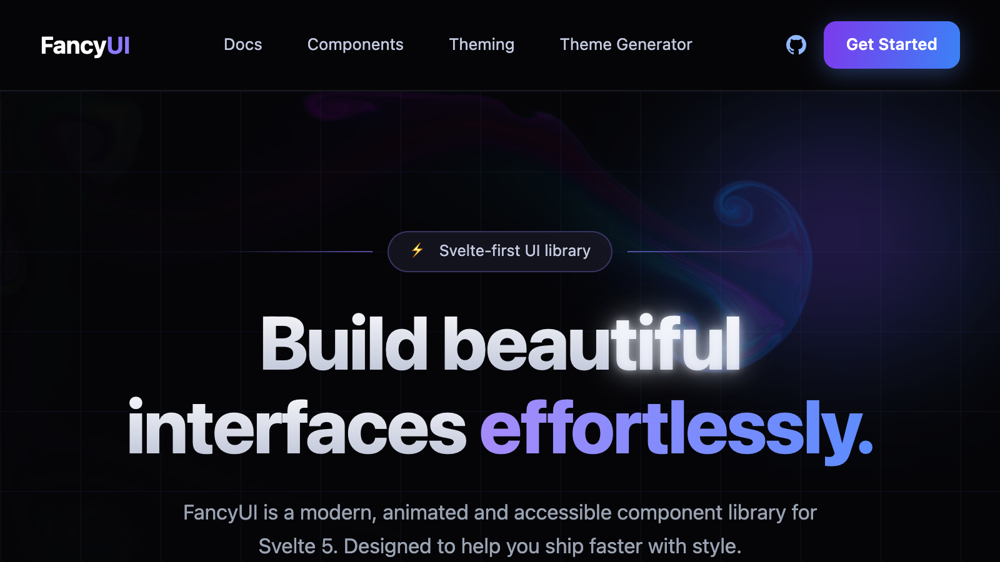

# fancy-ui

Beautiful animation and UI components for **Svelte 5**.


<p align="center">
  <a href="https://fancy-ui.rama.app">
    
  </a>
</p>

<p align="center">
  <a href="https://fancy-ui.rama.app"><strong>Live Demo</strong></a>
</p>

## Features

- **Svelte 5 Runes** &mdash; Built with `$state`, `$derived`, `$effect`, and `$props`
- **Tailwind CSS 4** &mdash; Utility-first styling with theme tokens
- **TypeScript** &mdash; Fully typed props and events
- **52 Components** &mdash; Buttons, text animations, backgrounds, effects, and more
- **Dark Mode** &mdash; All components support light and dark themes
- **Tested** &mdash; Component tests with Vitest and Testing Library

## Components

### Buttons

| Component | Description | Demo |
|-----------|-------------|------|
| RainbowButton | Animated rainbow gradient border effect | [Demo](https://fancy-ui.rama.app/demo/rainbow-button) |
| RippleButton | Ripple click effect | [Demo](https://fancy-ui.rama.app/demo/ripple-button) |
| ShimmerButton | Rotating conic-gradient shimmer border | [Demo](https://fancy-ui.rama.app/demo/shimmer-button) |
| GradientButton | Rotating conic-gradient rainbow border | [Demo](https://fancy-ui.rama.app/demo/gradient-button) |
| InteractiveHoverButton | Hover effect revealing alternate content | [Demo](https://fancy-ui.rama.app/demo/interactive-hover-button) |

### Cards

| Component | Description | Demo |
|-----------|-------------|------|
| Card3D | 3D tilt card with mouse tracking | [Demo](https://fancy-ui.rama.app/demo/card-3d) |
| CardSpotlight | Spotlight effect following mouse | [Demo](https://fancy-ui.rama.app/demo/card-spotlight) |
| DirectionAwareHover | Overlay slides in from mouse entry direction | [Demo](https://fancy-ui.rama.app/demo/direction-aware-hover) |
| FlipCard | Two-sided card with flip animation | [Demo](https://fancy-ui.rama.app/demo/flip-card) |
| GlareCard | Glare reflection effect on hover | [Demo](https://fancy-ui.rama.app/demo/glare-card) |
| TextRevealCard | Text reveal on hover | [Demo](https://fancy-ui.rama.app/demo/text-reveal-card) |

### Text & Typography

| Component | Description | Demo |
|-----------|-------------|------|
| BlurReveal | Scroll-triggered blur-to-clear reveal | [Demo](https://fancy-ui.rama.app/demo/blur-reveal) |
| BoxReveal | Sliding colored box reveal animation | [Demo](https://fancy-ui.rama.app/demo/box-reveal) |
| ColourfulText | Per-character color animation | [Demo](https://fancy-ui.rama.app/demo/colourful-text) |
| ContainerTextFlip | Text flipping inside a container | [Demo](https://fancy-ui.rama.app/demo/container-text-flip) |
| FlipWords | Cycling word animation with per-letter effects | [Demo](https://fancy-ui.rama.app/demo/flip-words) |
| HyperText | Character scramble on hover | [Demo](https://fancy-ui.rama.app/demo/hyper-text) |
| LetterPullup | Staggered letter pull-up animation | [Demo](https://fancy-ui.rama.app/demo/letter-pullup) |
| LineShadowText | Text with animated line shadow | [Demo](https://fancy-ui.rama.app/demo/line-shadow-text) |
| NumberTicker | Animated number counter with easing | [Demo](https://fancy-ui.rama.app/demo/number-ticker) |
| SparklesText | Animated SVG sparkle stars overlay | [Demo](https://fancy-ui.rama.app/demo/sparkles-text) |
| TextGenerateEffect | Word-by-word text generation effect | [Demo](https://fancy-ui.rama.app/demo/text-generate-effect) |

### Backgrounds

| Component | Description | Demo |
|-----------|-------------|------|
| FallingStarsBg | Canvas 3D starfield with motion trails | [Demo](https://fancy-ui.rama.app/demo/bg-falling-stars) |
| FlickeringGrid | Canvas grid with flickering opacity | [Demo](https://fancy-ui.rama.app/demo/flickering-grid) |
| InteractiveGridPattern | SVG grid with hover highlights | [Demo](https://fancy-ui.rama.app/demo/interactive-grid-pattern) |
| StarsBackground | Starfield with parallax mouse tracking | [Demo](https://fancy-ui.rama.app/demo/bg-stars) |

### Effects & Animations

| Component | Description | Demo |
|-----------|-------------|------|
| AnimatedBeam | SVG beams connecting elements | [Demo](https://fancy-ui.rama.app/demo/animated-beam) |
| BorderBeam | Beam effect traveling around borders | [Demo](https://fancy-ui.rama.app/demo/border-beam) |
| Confetti | Configurable confetti burst | [Demo](https://fancy-ui.rama.app/demo/confetti) |
| FluidCursor | WebGL fluid simulation following cursor | [Demo](https://fancy-ui.rama.app/demo/fluid-cursor) |
| GlowBorder | Animated glowing border with gradients | [Demo](https://fancy-ui.rama.app/demo/glow-border) |
| GlowingEffect | Glowing highlight on hover | [Demo](https://fancy-ui.rama.app/demo/glowing-effect) |
| ImageTrailCursor | Cursor-following image trail (8 variants) | [Demo](https://fancy-ui.rama.app/demo/image-trail-cursor) |
| LiquidGlass | Liquid glass morphism effect | [Demo](https://fancy-ui.rama.app/demo/liquid-glass) |
| Meteors | Animated meteor shower effect | [Demo](https://fancy-ui.rama.app/demo/meteors) |
| NeonBorder | Dual-color neon glow border | [Demo](https://fancy-ui.rama.app/demo/neon-border) |
| Ripple | Expanding ripple rings | [Demo](https://fancy-ui.rama.app/demo/ripple) |
| SmoothCursor | Smooth lagging cursor follower | [Demo](https://fancy-ui.rama.app/demo/smooth-cursor) |
| Sparkles | Particle sparkle canvas | [Demo](https://fancy-ui.rama.app/demo/sparkles) |
| TracingBeam | Scroll-driven tracing beam | [Demo](https://fancy-ui.rama.app/demo/tracing-beam) |

### Layout

| Component | Description | Demo |
|-----------|-------------|------|
| BentoGrid | Bento-style responsive grid layout | [Demo](https://fancy-ui.rama.app/demo/bento-grid) |
| Book | 3D book flip animation | [Demo](https://fancy-ui.rama.app/demo/book) |
| ContainerScroll | 3D scroll perspective container | [Demo](https://fancy-ui.rama.app/demo/container-scroll) |
| Focus | Focus-expand card layout | [Demo](https://fancy-ui.rama.app/demo/focus) |
| Marquee | Infinite scrolling for text, images, or cards | [Demo](https://fancy-ui.rama.app/demo/marquee) |

### Navigation & Display

| Component | Description | Demo |
|-----------|-------------|------|
| AnimatedTooltip | Avatar row with mouse-following tooltips | [Demo](https://fancy-ui.rama.app/demo/animated-tooltip) |
| Compare | Before/after image comparison slider | [Demo](https://fancy-ui.rama.app/demo/compare) |
| Dock | macOS-style dock with icon magnification | [Demo](https://fancy-ui.rama.app/demo/dock) |
| LogoCloud | Marquee, grid, and icon logo layouts | [Demo](https://fancy-ui.rama.app/demo/logo-cloud) |
| Timeline | Vertical timeline with scroll-driven progress | [Demo](https://fancy-ui.rama.app/demo/timeline) |

## Quick Start

**Install via npm:**

```bash
npm install fancy-ui-svelte
```

Then import any component:

```ts
import { Marquee, BorderBeam, Confetti } from 'fancy-ui-svelte';
```

To include Tailwind classes, add this to your app's CSS:

```css
@import "fancy-ui-svelte/tailwind.css";
```

**Or browse and copy a component:**
1. Find the component you need in the [live demo](https://fancy-ui.rama.app)
2. Copy the source from `src/lib/fancy-ui/[component-name]/`
3. Paste into your project

**Or clone the full demo locally:**

```bash
git clone https://github.com/RamaHerbin/fancy-ui.git
cd fancy-ui
pnpm install
pnpm dev
```

## Development

```bash
pnpm dev          # Start dev server
pnpm check        # Run Svelte type checker
pnpm test         # Run tests
pnpm test:watch   # Run tests in watch mode
pnpm build        # Production build
```

## Project Structure

```
src/
├── lib/
│   ├── fancy-ui/          # UI components (one folder per component)
│   │   ├── rainbow-button/
│   │   │   ├── RainbowButton.svelte
│   │   │   ├── RainbowButton.test.ts
│   │   │   ├── index.ts
│   │   │   └── README.md
│   │   ├── registry.ts    # Component registry & metadata
│   │   └── index.ts       # Barrel exports
│   └── components/ui/     # shadcn-svelte primitives
├── routes/
│   ├── +page.svelte       # Home page
│   └── demo/              # Component demo pages
│       └── [component]/+page.svelte
└── tests/
```

## Contributing

Contributions are welcome! 52 components and counting — PRs for new components, bug fixes, and improvements are appreciated.

### Adding a new component

1. Create the component folder under `src/lib/fancy-ui/`
2. Implement the component in idiomatic Svelte 5
3. Add a demo page at `src/routes/demo/[slug]/+page.svelte`
4. Register it in `src/lib/fancy-ui/registry.ts`
5. Export it from `src/lib/fancy-ui/index.ts`

## Tech Stack

| Technology | Version | Purpose |
|------------|---------|---------|
| [Svelte](https://svelte.dev) | 5 | UI framework |
| [SvelteKit](https://svelte.dev/docs/kit) | 2 | App framework |
| [Tailwind CSS](https://tailwindcss.com) | 4 | Styling |
| [TypeScript](https://www.typescriptlang.org) | 5 | Type safety |
| [Vitest](https://vitest.dev) | 4 | Testing |
| [bits-ui](https://bits-ui.com) | 2 | Headless primitives |
| [GSAP](https://gsap.com) | 3 | Advanced animations |

## Credits

Inspired by [Inspira UI](https://inspira-ui.com), [Aceternity UI](https://ui.aceternity.com) and [Magic UI](https://magicui.design).

## License

MIT
